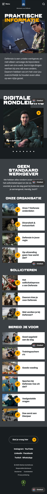

# Procesverslag

Markdown is een simpele manier om HTML te schrijven.  
Markdown cheat cheet: [Hulp bij het schrijven van Markdown](https://github.com/adam-p/markdown-here/wiki/Markdown-Cheatsheet).

Nb. De standaardstructuur en de spartaanse opmaak van de README.md zijn helemaal prima. Het gaat om de inhoud van je procesverslag. Besteedt de tijd voor pracht en praal aan je website.

Nb. Door _open_ toe te voegen aan een _details_ element kun je deze standaard open zetten. Fijn om dat steeds voor de relevante stuk(ken) te doen.

## Jij

uitwerken voor kick-off werkgroep

### Auteur:

Guillermo de Jong

#### Je startniveau:

Rood

#### Je focus:

responsive Design

## Je website

  

  
uitwerken voor kick-off werkgroep

### Je opdracht:

https://werkenbijdefensie.nl/

#### Screenshot(s) van de eerste pagina (small screen):

Praktische informatie

#### Screenshot(s) van de tweede pagina (small screen):

Events

## Toegankelijkheidstest 1/2 (week 1)

  
uitwerken na test in 2e werkgroep

### Bevindingen

Lijst met je bevindingen die in de test naar voren kwamen:

Ik merk dat het, zeker in het begin, lastig is om te weten welke knopen je nodig hebt. Soms wou ik sneller door de inhoud heen dan de voice-over toelaat. Tijdens het testen van de website vielen er ook een aantal andere dingen op.
Zo benoemt de screenreader bepaalde onderdelen die de gebruiker op dat moment niet ziet. Een voorbeeld hiervan is het hoofdmenu: alle kopjes worden benoemd, maar visueel zijn ze niet zichtbaar. Je moet dus onthouden wat er gezegd wordt, wat voor slechtziende mensen erg vervelend kan zijn. Zij zien vaak nog wel bepaalde elementen.
In het begin vond ik het bovendien lastig om de chatbot te openen die onderaan het scherm staat. Ik weet niet of dit een fout in de website is, of dat ik zelf niet de juiste rotor of knop gebruikte.
Ook de titel op de homepage levert problemen op. Deze luidt: “Tijd vo:or defensie”. Volgens de bedoeling moet dit aangeven dat het tijd is om bij Defensie te gaan, maar de screenreader splitst dit op in twee losse woorden (“vo” en “or”), en leest de dubbele punt als een afbeelding.
Positief is dat de website een contrastmodus aanbiedt, wat erg waardevol is voor mensen met verminderd zicht. Wel vond ik dat deze functie zonder screenreader lastig te vinden en te activeren was.
Daarnaast heb ik het idee dat de afbeeldingen op de website geen alt-teksten hebben. De screenreader benoemt ze simpelweg als “afbeelding”, zonder verdere beschrijving. Dit maakt het moeilijk om te begrijpen wat er daadwerkelijk op de afbeeldingen te zien is.
Tot slot viel me op dat de screenreader in Word bij het typen iedere letter afzonderlijk benoemt. Na een tijdje werd dit erg hinderlijk en zelfs frustrerend.

## Breakdownschets (week 1)

  
uitwerken na afloop 3e werkgroep

### de hele pagina:

  

### dynamisch deel (bijv menu):

  

### wellicht nog een dynamisch deel (bijv filter):

  

## Voortgang 1 (week 2)

  
uitwerken voor 1e voortgang

### Stand van zaken

Tot nu toe gaat het aardig goed met de opdracht. Het frame van de eerste pagina staat zo goed als klaar, en nu bezig met de css voor die pagina. in het begin was het nog even zoeken welke webite ik wou gaan maken, maar uiteindelijk een, hopelijk goede, keuze kunnen maken.

### Agenda voor meeting

samen met je groepje opstellen

| student 1      | student 2          | student 3    | student 4        |
| -------------- | ------------------ | ------------ | ---------------- |
| dit bespreken  | en dit             | en ik dit    | en dan ik dat    |
| en dat ook nog | dit als er tijd is | nog een punt | dit wil ik zeker |
| ...            | ...                | ...          | ...              |

### Verslag van meeting

hier na afloop snel de uitkomsten van de meeting vastleggen

- punt 1
- punt 2
- nog een punt
- ...

## Voortgang 2 (week 3)

  
uitwerken voor 2e voortgang

### Stand van zaken

hier dit ging goed & dit was lastig (neem ook screenshots op van delen van je website en code)

### Agenda voor meeting

samen met je groepje opstellen

| student 1      | student 2          | student 3    | student 4        |
| -------------- | ------------------ | ------------ | ---------------- |
| dit bespreken  | en dit             | en ik dit    | en dan ik dat    |
| en dat ook nog | dit als er tijd is | nog een punt | dit wil ik zeker |
| ...            | ...                | ...          | ...              |

### Verslag van meeting

hier na afloop snel de uitkomsten van de meeting vastleggen

- punt 1
- punt 2
- nog een punt
- ...

## Toegankelijkheidstest 2/2 (week 4)

  
uitwerken na test in 9e werkgroep

### Bevindingen

Lijst met je bevindingen die in de test naar voren kwamen (geef ook aan wat er verbeterd is):

## Voortgang 3 (week 4)

  
uitwerken voor 3e voortgang

### Stand van zaken

hier dit ging goed & dit was lastig (neem ook screenshots op van delen van je website en code)

### Agenda voor meeting

samen met je groepje opstellen

| student 1      | student 2          | student 3    | student 4        |
| -------------- | ------------------ | ------------ | ---------------- |
| dit bespreken  | en dit             | en ik dit    | en dan ik dat    |
| en dat ook nog | dit als er tijd is | nog een punt | dit wil ik zeker |
| ...            | ...                | ...          | ...              |

### Verslag van meeting

hier na afloop snel de uitkomsten van de meeting vastleggen

- punt 1
- punt 2
- nog een punt
- ...

## Eindgesprek (week 5)

  
uitwerken voor eindgesprek

### Je uitkomst - karakteristiek screenshots:

  

### Dit ging goed/Heb ik geleerd:

Korte omschrijving met plaatjes

  

### Dit was lastig/Is niet gelukt:

Korte omschrijving met plaatjes

  

## Bronnenlijst

  
continu bijhouden terwijl je werkt

Nb. Wees specifiek ('css-tricks' als bron is bijv. niet specifiek genoeg).
Nb. ChatGpT en andere AI horen er ook bij.
Nb. Vermeld de bronnen ook in je code.

1. bron 1
2. bron 2
3. ...

